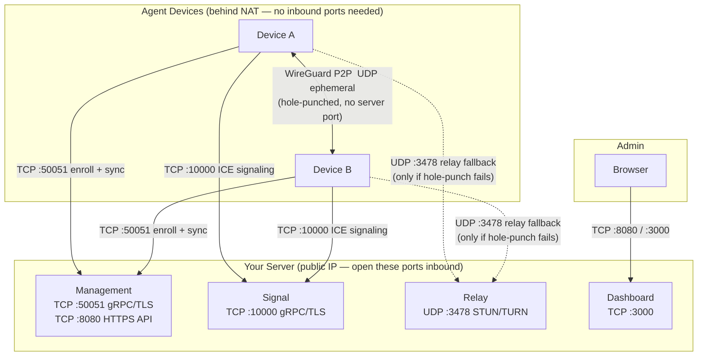

# Bline-X

[](#roadmap)
[](https://golang.org)
[](#license)
[](https://github.com/DJR-FP/blinex/actions/workflows/docker.yml)

A zero-trust WireGuard mesh VPN — open-source core, built for SMB and developer teams. Think Tailscale/NetBird, but simpler to self-host and extend.

---

## Features

- **Automatic NAT traversal** — ICE hole-punching (STUN) with TURN relay fallback; works across most NATs without port forwarding
- **Stable IPs** — every device gets a permanent CGNAT IP (`100.64.x.x`) and a Magic DNS hostname (`device.blinex`)
- **TLS encrypted control plane** — management and signal servers are TLS by default; self-signed cert generated automatically if none is provided
- **Exit node / subnet routing** — advertise a LAN subnet or full exit node through any mesh device; toggle per device in the dashboard
- **Tag-based access control** — group devices with tags (e.g. `tag:servers`, `tag:database`) and write ACL rules against groups; rules pushed to agents and enforced with iptables
- **Admin login** — username/password dashboard access independent of any enrolled device; set `MGMT_ADMIN_PASSWORD` to enable
- **Simple onboarding** — one `curl | bash` to enroll a device; JWT token appears in the dashboard
- **Web dashboard** — manage devices, routes, access rules, and setup keys from a browser
- **Self-hosted** — `docker compose up` and you own your data; no phone-home
- **PostgreSQL or in-memory** — swap the store with one env var

---

## Architecture

```
┌──────────────────────── Control Plane (TLS) ────────────────────────┐
│                                                                       │
│   Management Server           Signal Server        Relay Server      │
│   gRPC/TLS :50051             ICE candidate        STUN/TURN         │
│   HTTPS    :8080              relay (bidi gRPC/TLS) UDP :3478        │
│   JWT auth · REST API         :10000               pion/turn         │
│   PostgreSQL / in-memory                                              │
│                                                                       │
└───────────────────────────────────────────────────────────────────────┘
              ▲                         ▲
              │ gRPC/TLS                │ gRPC/TLS
              ▼                         ▼
┌──────────── Device (blinex-agent) ──────────────────────────────────┐
│                                                                       │
│  wireguard-go userspace TUN (blinex0)                                │
│  └── IceBind  routes WireGuard packets through ICE net.Conn          │
│  pion/ice  per-peer NAT traversal agents                              │
│  Magic DNS  127.0.0.1:53535  →  hostname.blinex                        │
│  Subnet / exit node routing  (netlink + iptables MASQUERADE)         │
│                                                                       │
└───────────────────────────────────────────────────────────────────────┘
```

---

## Firewall & Required Ports

The diagram below shows what connects to what and which ports must be reachable on your server from the internet. **Agent devices need no inbound ports open** — they only make outbound connections.



### Port reference

| Port | Protocol | Who connects | Required? | Purpose |
|------|----------|-------------|-----------|---------|
| **50051** | TCP | Agents | **Yes** | Management gRPC/TLS — enrollment, config sync, push updates |
| **10000** | TCP | Agents | **Yes** | Signal gRPC/TLS — ICE candidate exchange for NAT traversal |
| **3478** | UDP | Agents | Recommended | STUN/TURN relay — fallback when direct hole-punch fails (symmetric NAT) |
| **8080** | TCP | Browsers / agents | For dashboard | HTTPS REST API — also serves the dashboard if not separately proxied |
| **3000** | TCP | Browsers | Optional | Next.js dashboard (can be hidden behind a reverse proxy on :443) |

### What you do NOT need to open

- **No inbound ports on agent devices.** Agents only make outbound TCP connections to the server. WireGuard P2P traffic uses ephemeral UDP ports negotiated by ICE hole-punching — both sides connect outward and the packets meet in the middle.
- **No WireGuard UDP port on the server.** The server is not a WireGuard peer; it is a control plane only.

### Production recommendation

Put the management API and dashboard behind a reverse proxy (Nginx, Caddy, Traefik) on port **443**, issue a real TLS certificate, and close port 8080/3000 to the public. Only ports 50051 and 10000 need to stay directly exposed for agents.

```
Internet → :443 (HTTPS, reverse proxy) → :8080 management API / :3000 dashboard
Internet → :50051 (gRPC/TLS)           → management server
Internet → :10000 (gRPC/TLS)           → signal server
Internet → :3478  (UDP)                → relay server
```

---

## Docker Images

Pre-built images are published to GitHub Container Registry. Every push to `main` publishes `:latest`; version tags (e.g. `v0.2.0`) are published on release.

| Image | Pull command |
|---|---|
| Management | `docker pull ghcr.io/djr-fp/blinex/management:latest` |
| Signal | `docker pull ghcr.io/djr-fp/blinex/signal:latest` |
| Relay | `docker pull ghcr.io/djr-fp/blinex/relay:latest` |
| Dashboard | `docker pull ghcr.io/djr-fp/blinex/dashboard:latest` |

Pin a specific release: replace `:latest` with `:v0.3.0`.

---

## System Requirements

### Server (management + signal + relay)

All three server components are single Go binaries with very low resource usage. They can run on the same host or be split across separate machines.

| Component | Minimum | Recommended |
|---|---|---|
| **CPU** | 1 vCPU (x86-64 or ARM64) | 2 vCPU |
| **RAM** | 256 MB | 1 GB |
| **Disk** | 500 MB (binaries + logs) | 10 GB (PostgreSQL data) |
| **Network** | 10 Mbps uplink | 100 Mbps+ uplink |
| **OS** | Linux kernel 4.19+ | Linux kernel 5.10+ |
| **Peers (in-memory store)** | up to ~500 | — |
| **Peers (PostgreSQL)** | up to ~5,000 | up to ~50,000+ |

> **Relay bandwidth note:** The relay server only carries traffic that cannot hole-punch directly. In typical deployments fewer than 20% of peer pairs need TURN relay. Size your uplink for that fraction of your expected concurrent traffic.

#### Hosting options

| | Notes |
|---|---|
| VPS (1 GB RAM, 1 vCPU) | Handles most small teams (< 100 peers) |
| Dedicated server | Large networks, high-throughput exit nodes |
| Docker / Compose | Simplest setup — all components in one `compose.yml` |
| Kubernetes | Scale signal/relay horizontally; management needs shared PostgreSQL |

### Client (agent)

The agent uses userspace WireGuard (`wireguard-go`) instead of the kernel module for cross-platform NAT traversal via ICE. This uses slightly more CPU than kernel WireGuard but works everywhere without root access to kernel modules.

| | Minimum | Recommended |
|---|---|---|
| **CPU** | Any 64-bit (x86-64, ARM64, ARMv7) | Modern 64-bit |
| **RAM** | 64 MB free | 128 MB free |
| **Disk** | 30 MB (agent binary + state) | 50 MB |
| **OS** | Linux 4.19+, macOS 11+, Windows 10+ | Linux 5.10+ |
| **Throughput** | ~100 Mbps (low-end ARM) | ~400–800 Mbps (modern x86) |

> **Throughput note:** userspace WireGuard (`wireguard-go`) is CPU-bound. For high-throughput exit nodes or subnet routers, use a host with multiple cores or consider enabling kernel WireGuard if available on your platform.

> **Exit node / subnet router:** Peers advertising routes also run iptables `MASQUERADE`. The advertising host needs IP forwarding enabled (the agent does this automatically) and sufficient CPU to handle routed traffic at wire speed.

---

## LXC Deployment (Proxmox / Incus / LXD)

Bline-X runs well in LXC containers. The **server components** (management, signal, relay, dashboard) work in any standard unprivileged container with no special configuration. The **agent** creates a TUN interface and writes iptables rules, so it needs a small amount of extra kernel access.

### Server components in LXC

No special config required. Create a standard unprivileged Debian/Ubuntu container and run the Docker Compose stack or the binaries directly. The server only needs outbound network and the listening ports listed in [Firewall & Required Ports](#firewall--required-ports).

### Agent in LXC

The agent requires:
- `/dev/net/tun` device access (to create the WireGuard TUN interface)
- `NET_ADMIN` capability (for netlink routing and iptables)
- IP forwarding on the host (only for exit node / subnet router mode)

#### Option A — Unprivileged container (recommended)

Add the following to the container config on the Proxmox host:

**`/etc/pve/lxc/<id>.conf`** (or equivalent for Incus/LXD):

```ini
# Allow TUN device
lxc.cgroup2.devices.allow: c 10:200 rwm
lxc.mount.entry: /dev/net/tun dev/net/tun none bind,create=file

# Required for proc/sys visibility inside the container
features: nesting=1
```

In the Proxmox web UI: Container → Options → Features → tick **Nesting**.

Then inside the container, run the agent as root (or with `CAP_NET_ADMIN`):

```bash
sudo BLINEX_SETUP_KEY=<your-key> ./agent
```

#### Option B — Privileged container

Enable **Privileged** mode in Proxmox (Container → Options → Unprivileged container → untick). No additional LXC config needed — all capabilities are available by default.

> Privileged containers are less isolated. Use Option A where possible.

#### IP forwarding for exit node / subnet router mode

The agent enables IP forwarding automatically, but in an unprivileged LXC container the sysctl write may be blocked by the host. Set it persistently on the **Proxmox host** instead:

```bash
# On the Proxmox host (not inside the container)
echo "net.ipv4.ip_forward=1" >> /etc/sysctl.d/99-blinex.conf
sysctl -p /etc/sysctl.d/99-blinex.conf
```

#### Feature support matrix

| Feature | Unprivileged LXC | Privileged LXC | Bare metal / VM |
|---|---|---|---|
| WireGuard TUN interface | ✅ (with TUN config above) | ✅ | ✅ |
| Peer-to-peer connectivity | ✅ | ✅ | ✅ |
| ACL iptables rules | ✅ | ✅ | ✅ |
| Subnet routing | ✅ | ✅ | ✅ |
| Exit node | ✅ (IP forwarding on host) | ✅ | ✅ |
| Magic DNS | ✅ | ✅ | ✅ |

#### iptables note

iptables rules written inside an LXC container operate on the **host kernel's netfilter tables**. Rules added by the agent (the `BLINEX-ACL` chain) will be visible in the host's `iptables -L` output. This is normal — they are scoped to the container's network interface and do not affect other containers or the host's own traffic.

---

## Quick Start

### Docker Compose (pre-built images)

```bash
git clone https://github.com/DJR-FP/overlay.git
cd overlay

cp .env.example .env
# Edit .env — set JWT_SECRET, POSTGRES_PASSWORD, RELAY_PUBLIC_IP

docker compose up -d
```

| Service | URL | Protocol |
|---|---|---|
| Dashboard | https://localhost:3000 | HTTPS |
| Management API | https://localhost:8080 | HTTPS |
| Management gRPC | localhost:50051 | gRPC/TLS |
| Signal | localhost:10000 | gRPC/TLS |
| TURN relay | localhost:3478 | UDP |

> **TLS note:** By default the management and signal servers generate a self-signed certificate on startup. Agents connect with `InsecureSkipVerify` enabled so everything works out of the box. See [TLS configuration](#tls) to provide real certificates.

### Enroll a device

```bash
curl -fsSL https://raw.githubusercontent.com/DJR-FP/blinex-agent/main/install.sh | \
  BLINEX_SETUP_KEY=YOUR_KEY \
  BLINEX_MANAGEMENT_URL=your-server:50051 \
  BLINEX_SIGNAL_URL=your-server:10000 \
  sudo -E bash
```

| Variable | Default | Description |
|----------|---------|-------------|
| `BLINEX_SETUP_KEY` | _(required)_ | Enrollment key from the Setup Keys page |
| `BLINEX_MANAGEMENT_URL` | `localhost:50051` | Management server gRPC address |
| `BLINEX_SIGNAL_URL` | `localhost:10000` | Signal server address |
| `BLINEX_VERSION` | `latest` | Pin a specific release version |

The agent prints a JWT on first enrollment — paste it into the dashboard to sign in.

### Uninstall a device

Pre-built uninstall binaries are included in each [release](https://github.com/DJR-FP/blinex-agent/releases).

**Linux / macOS:**

```bash
# Download and run the uninstaller
curl -fsSL https://github.com/DJR-FP/blinex-agent/releases/latest/download/blinex-uninstall-linux-amd64 -o blinex-uninstall
chmod +x blinex-uninstall
sudo ./blinex-uninstall

# Or use the shell script
curl -fsSL https://raw.githubusercontent.com/DJR-FP/blinex-agent/main/uninstall.sh | sudo bash
```

**Windows:** Download `blinex-uninstall-windows-amd64.exe` from the [latest release](https://github.com/DJR-FP/blinex-agent/releases) and run as Administrator.

The uninstaller removes the service, binary, config, state, firewall rules, and network interface. The device stays listed in the dashboard until you delete it there.

### Development (no Docker)

> Requires Go 1.25+, Node.js 20+, and root/sudo to create a TUN device.

```bash
# Build all binaries (version injected from VERSION file)
make build

# Start services
MGMT_JWT_SECRET=dev ./bin/management   &   # terminal 1
./bin/signal                            &   # terminal 2
sudo BLINEX_SETUP_KEY=BLINEX-DEFAULT-KEY ./bin/agent  # terminal 3

# Dashboard
cd dashboard && npm install && npm run dev   # http://localhost:3000
```

---

## Admin Login

The dashboard supports two login methods:

| Method | Tab | When to use |
|---|---|---|
| **Admin login** | "Admin login" (default) | Manage the network without needing an enrolled device |
| **Device token** | "Device token" | Paste the JWT printed by an enrolling agent |

### Enabling admin login

Set `MGMT_ADMIN_PASSWORD` in your `.env` before starting the stack:

```bash
MGMT_ADMIN_USER=admin           # optional, defaults to "admin"
MGMT_ADMIN_PASSWORD=your-password
```

Then open the dashboard — the **Admin login** tab will accept those credentials. A 24-hour JWT is issued and stored as an HttpOnly cookie.

> If `MGMT_ADMIN_PASSWORD` is not set, the Admin login tab is present but will return an error — set the env var to activate it.

### REST API

```
POST /api/v1/auth/login
Content-Type: application/json

{"username": "admin", "password": "your-password"}
```

Returns `{"token": "<jwt>"}` on success. Use the token as a Bearer token for subsequent API calls.

---

## Project Structure

```
overlay/
├── VERSION             Single source of truth for the release version
├── management/         Management server — device registry, IPAM, REST + gRPC
├── signal/             ICE candidate relay — stateless gRPC/TLS message router
├── relay/              STUN/TURN relay — pion/turn, fallback for symmetric NAT
├── client/             Agent binary — WireGuard, ICE, routing, Magic DNS
├── dashboard/          Web UI — Next.js 14, TypeScript, Tailwind CSS
├── proto/              Protobuf definitions (source of truth)
├── gen/                Generated Go stubs — do not edit
├── install.sh          One-line device enrollment script
└── docker-compose.yml
```

---

## Configuration

### Management Server

| Env var | Default | Description |
|---|---|---|
| `MGMT_GRPC_ADDR` | `:50051` | gRPC/TLS listen address |
| `MGMT_HTTP_ADDR` | `:8080` | HTTPS REST API listen address |
| `MGMT_JWT_SECRET` | _(required)_ | JWT signing secret — min 32 chars, generate with `openssl rand -hex 32` |
| `MGMT_NETWORK_CIDR` | `100.64.0.0/10` | CGNAT IP pool |
| `MGMT_DNS_SUFFIX` | `blinex` | Magic DNS suffix |
| `MGMT_ALLOWED_ORIGINS` | `http://localhost:3000` | Allowed CORS origins (comma-separated); set to your dashboard URL in production |
| `DATABASE_URL` | _(empty = memory)_ | PostgreSQL DSN |
| `BLINEX_DEFAULT_KEY` | _(random on startup)_ | Seed setup key; set to a fixed value to survive restarts |
| `TLS_CERT_FILE` | _(empty = self-signed)_ | Path to TLS certificate PEM |
| `TLS_KEY_FILE` | _(empty = self-signed)_ | Path to TLS private key PEM |
| `GRPC_REFLECTION` | `false` | Set `true` to enable gRPC reflection (dev only) |
| `MGMT_ADMIN_USER` | `admin` | Dashboard admin username |
| `MGMT_ADMIN_PASSWORD` | _(empty = disabled)_ | Dashboard admin password — set this to enable admin login |

### Signal Server

| Env var | Default | Description |
|---|---|---|
| `SIGNAL_ADDR` | `:10000` | gRPC/TLS listen address |
| `MGMT_JWT_SECRET` | _(empty = no auth)_ | Set to the same value as management to require JWT on signal connections |
| `TLS_CERT_FILE` | _(empty = self-signed)_ | Path to TLS certificate PEM |
| `TLS_KEY_FILE` | _(empty = self-signed)_ | Path to TLS private key PEM |
| `GRPC_REFLECTION` | `false` | Set `true` to enable gRPC reflection (dev only) |

### Agent

| Env var | Default | Description |
|---|---|---|
| `BLINEX_SETUP_KEY` | _(required)_ | Enrollment key |
| `BLINEX_MANAGEMENT_URL` | `localhost:50051` | Management gRPC address |
| `BLINEX_SIGNAL_URL` | `localhost:10000` | Signal gRPC address |
| `BLINEX_WG_IFACE` | `blinex0` | TUN interface name |
| `BLINEX_STATE_DIR` | `/var/lib/blinex` | Key + token persistence dir |
| `BLINEX_STUN_URLS` | `stun:stun.l.google.com:19302` | STUN/TURN URLs (comma-separated) |
| `BLINEX_DNS_UPSTREAM` | `8.8.8.8:53` | Upstream DNS resolver for non-mesh queries |
| `BLINEX_TLS_SKIP_VERIFY` | `true` | When `true` (default), TOFU fingerprint pinning is used instead of full CA validation |
| `BLINEX_TLS_CA_CERT` | _(empty)_ | Path to CA cert PEM — pins a specific CA, disables skip-verify |

### Relay

| Env var | Default | Description |
|---|---|---|
| `RELAY_PUBLIC_IP` | _(required)_ | Public IP of the relay host |
| `RELAY_UDP_PORT` | `3478` | STUN/TURN port |
| `RELAY_AUTH_USER` | `blinex` | TURN long-term credential user |
| `RELAY_AUTH_PASS` | `change-me` | TURN password |

---

## TLS

All control-plane connections (agent ↔ management, agent ↔ signal) are TLS encrypted.

### Default: self-signed certificate

No configuration needed. Both servers generate an in-memory ECDSA P-256 self-signed certificate on startup and log a warning:

```
WARN using self-signed TLS certificate — set TLS_CERT_FILE + TLS_KEY_FILE for production
```

Agents use **TOFU (Trust On First Use)** fingerprint pinning by default. On the first connection to each server, the certificate fingerprint is stored in `state.json`. Subsequent connections verify against the stored fingerprint — a changed certificate will be rejected until `state.json` is deleted. The fingerprint is logged at startup so you can verify it out-of-band:

```
INFO TOFU: pinned server certificate — verify this fingerprint on first use server=localhost:50051 fingerprint=3a4f8c1d...
```

### Production: real certificates

Set on both management and signal servers:

```bash
TLS_CERT_FILE=/etc/blinex/server.crt
TLS_KEY_FILE=/etc/blinex/server.key
```

Set on agents:

```bash
# Option A — disable skip-verify (requires a CA trusted by the OS)
BLINEX_TLS_SKIP_VERIFY=false

# Option B — pin your own CA cert (recommended for self-hosted CA)
BLINEX_TLS_SKIP_VERIFY=false
BLINEX_TLS_CA_CERT=/etc/blinex/ca.crt
```

Certificates can be obtained from Let's Encrypt (via Certbot or Caddy) or an internal CA.

---

## Subnet Routing & Exit Nodes

Any mesh device can advertise subnets or act as a full exit node. Configuration is done from the dashboard — no agent restart required.

### How it works

1. Admin opens a device in the dashboard → **Routes** → toggles **Exit node** or enters a subnet CIDR (e.g. `192.168.1.0/24`)
2. Management stores the routes and immediately pushes an updated `SyncResponse` to all connected agents
3. Each agent updates WireGuard `AllowedIPs` for the advertising peer
4. For subnet routes, the agent also adds an OS route via netlink
5. The advertising device automatically enables IP forwarding and adds an iptables `MASQUERADE` rule

### Exit node vs subnet routing

| | Exit node | Subnet routing |
|---|---|---|
| Advertised CIDR | `0.0.0.0/0` | e.g. `192.168.1.0/24` |
| Effect on other peers | All internet traffic routed through this device | Only traffic for that subnet routed through this device |
| Gateway setup | IP forwarding + masquerade | IP forwarding + masquerade |
| OS route on consumers | Automatic — split-tunnel /1 routes via WireGuard | Added automatically via netlink |

### Exit node split-tunnel routing

When a peer becomes active as an exit node, consuming peers automatically:

1. Read the current default gateway IP and interface before touching any routes
2. Add `/32` host routes for the management and signal servers via the original gateway — so control-plane connections always bypass the tunnel
3. Add `0.0.0.0/1` and `128.0.0.0/1` routes via the WireGuard interface — these are more specific than the existing `/0` default route and win in the routing table without replacing it
4. On exit node removal, all routes are cleanly torn down and the host pins are removed

This means the management connection is never interrupted, even when a full exit node is active.

---

## Access Control Rules

By default all enrolled devices can reach each other. Access rules let you restrict traffic by source, destination, protocol and port. Rules are evaluated in ascending priority order (lowest number first).

### How it works

1. Admin opens **Access Rules** in the dashboard → clicks **+ Add rule**
2. Fills in source (IP, CIDR, or `*`), destination, protocol (`all`, `tcp`, `udp`, `icmp`), port (0 = any), action (`allow` / `deny`), and priority
3. Management stores the rule and immediately pushes the full rule set to all connected agents via gRPC sync
4. Each agent installs the rules into a dedicated `BLINEX-ACL` iptables chain (jumped from `INPUT` and `FORWARD`) — flush-and-reinstall on every update

### REST API

```
GET    /api/v1/rules          list all rules for the account
POST   /api/v1/rules          create a rule
PUT    /api/v1/rules/:id      update a rule (partial — only sent fields are changed)
DELETE /api/v1/rules/:id      delete a rule
```

### Example rule payload

```json
{
  "name": "Block SSH from internet",
  "src": "*",
  "dst": "100.64.0.5",
  "protocol": "tcp",
  "port": 22,
  "action": "deny",
  "enabled": true,
  "priority": 10
}
```

> **Default policy:** if no rules are defined the default is allow-all. If any deny rule exists, an explicit `ACCEPT` is appended at the end of the chain so unmatched traffic is still allowed unless you add a catch-all deny rule.

---

## How NAT Traversal Works

Standard WireGuard uses a fixed UDP socket. STUN discovers the external address of that socket, but the port mapping often doesn't survive NAT — hole-punching fails.

Bline-X solves this with **wireguard-go** (userspace) and a custom `IceBind` (`conn.Bind` interface):

```
WireGuard device (wireguard-go)
    │
    ▼
IceBind  ──── per-peer net.Conn (from pion/ice)
    │
    ▼
ICE agent ──── STUN candidate → hole-punch → direct P2P
              (or TURN relay if hole-punch fails)
```

The ICE-established connection *is* the WireGuard transport — no port mismatch.

**Role assignment:** The peer with the lexicographically smaller WireGuard public key becomes the ICE controller. Deterministic, no coordination needed.

---

## Versioning

The current version is stored in the [`VERSION`](VERSION) file. It is injected into every binary at build time and exposed at runtime via:

- Startup log: `INFO blinex management starting version=v0.4.0`
- Health endpoint: `GET /api/v1/health` → `{"status":"ok","version":"v0.4.0"}`

To release a new version:

```bash
# 1. Edit VERSION
echo "0.5.0" > VERSION

# 2. Commit
git add VERSION && git commit -m "chore: bump to v0.5.0"

# 3. Tag and push (triggers Docker image builds in CI)
make tag
```

Docker images are tagged with both `:latest` and `:vX.Y.Z` on every push to `main` and on version tags.

---

## Regenerating Protobuf Stubs

```bash
# Install once
go install google.golang.org/protobuf/cmd/protoc-gen-go@latest
go install google.golang.org/grpc/cmd/protoc-gen-go-grpc@latest
go install github.com/bufbuild/buf/cmd/buf@latest

# Regenerate after editing .proto files
buf generate
```

---

## Roadmap

### Next up
- [ ] **OIDC / SSO login** — Google, GitHub OAuth2 as an alternative to setup key login
- [ ] **ACL groups** — tag-based policy (e.g. `tag:servers`) instead of individual IPs
- [ ] **ICE restart** — reconnect peers automatically on connection drop without agent restart

### Planned
- [ ] ICE restart on connection drop
- [ ] iOS + Android clients (wireguard-go + pion/ice)
- [ ] Kubernetes Helm chart

### Done ✅
- [x] **Admin login** — username/password dashboard access via `MGMT_ADMIN_PASSWORD`; independent of agent enrollment (v0.5.1)
- [x] **Security hardening** — HttpOnly cookie auth, TOFU cert pinning, gRPC rate limiting, JWT revocation on delete, signal server JWT auth, configurable CORS/DNS, 24h token expiry (v0.5.0)
- [x] **Exit node OS routing** — split-tunnel /1 routes + host-route pinning for management/signal; no manual policy routing needed (v0.4.0)
- [x] **Access control rules** — source/destination/protocol/port policy editor, iptables enforcement on agents (v0.3.0)
- [x] TLS encryption on all control-plane connections (self-signed cert fallback) (v0.2.0)
- [x] Exit node / subnet routing — dashboard toggle, WG AllowedIPs, OS routes, IP forwarding + masquerade (v0.2.0)
- [x] Semantic versioning — `VERSION` file, ldflags injection, Docker image tags (v0.2.0)
- [x] WireGuard mesh with ICE NAT traversal (STUN hole-punching + TURN relay fallback)
- [x] CGNAT IP allocation (100.64.0.0/10) + Magic DNS (`hostname.blinex`)
- [x] Management server — gRPC + REST API, JWT auth, CORS
- [x] PostgreSQL store (GORM) with in-memory fallback
- [x] Setup keys — create, list, revoke via dashboard
- [x] Web dashboard — devices, routes, setup keys (Next.js 14)
- [x] Docker images published to GHCR (`:latest` + `:vX.Y.Z`)
- [x] GitHub Actions CI — auto-build & push on every commit

---

## License

| Component | License |
|---|---|
| `client/`, `signal/`, `relay/`, `gen/`, `proto/` | MIT |
| `management/`, `dashboard/` | BSL 1.1 (converts to MIT after 4 years) |
