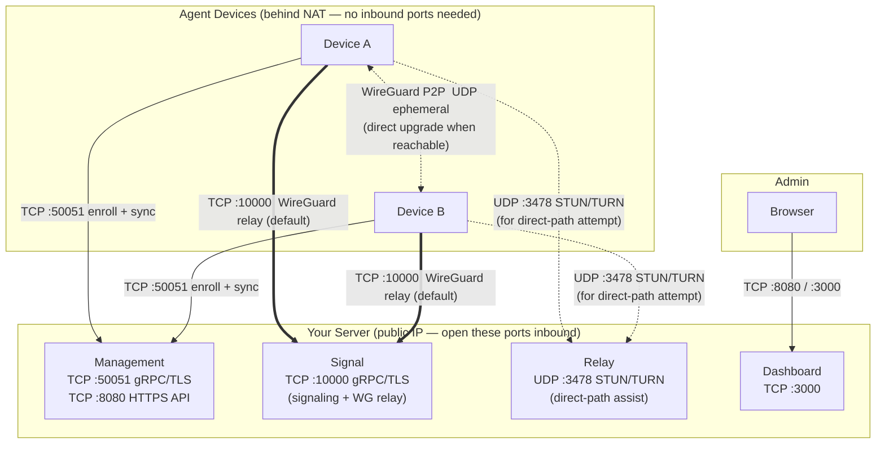

# Bline-X

[](#roadmap)
[](https://golang.org)
[](#license)
[](https://github.com/DJR-FP/blinex/actions/workflows/docker.yml)

A zero-trust WireGuard mesh VPN — open-source core, built for SMB and developer teams. Think Tailscale/NetBird, but simpler to self-host and extend.

---

## Features

- **Works behind any NAT** — WireGuard traffic is relayed through the signal server (DERP-style), so peers connect without port forwarding or hole-punching. All traffic stays end-to-end encrypted by WireGuard regardless of path
- **Stable IPs** — every device gets a permanent CGNAT IP (`100.64.x.x`) and a Magic DNS hostname (`device.blinex`), renameable from the dashboard — click a device's name to edit it; the OS-reported hostname is only used to name a device the first time it enrolls
- **OS at a glance** — each device card shows its platform (`windows`, `linux`, ...) next to its name
- **Magic DNS, actually automatic** — the agent points the OS at its own resolver on startup and cleanly reverts on exit, the way NetBird/Tailscale's MagicDNS does, so hostnames and domain filtering both work with zero manual DNS configuration. Linux kernel-TUN peers get a per-link override via `resolvectl`; netstack peers (Windows, unprivileged LXC — no real interface to attach a per-link override to) get a small local UDP relay plus a rewritten `/etc/resolv.conf` or adapter DNS settings instead, with the original backed up and restored on exit. macOS isn't covered yet (no macOS test environment to verify against)
- **TLS encrypted control plane** — management and signal servers are TLS by default; self-signed cert generated automatically if none is provided
- **Exit node / subnet routing** — advertise a LAN subnet or full exit node through any mesh device; toggle per device in the dashboard
- **Group-based access control** — every device is always in `Default`; setup keys can drop new devices straight into other groups too. ACL rules match against groups (e.g. `group:servers`, `group:database`) and are deny-by-default — a fresh account is seeded with one `Default → Default, allow` rule so devices can reach each other out of the box, matching NetBird's own starting policy
- **Malicious-domain filtering** — on by default, no per-device setup. The management server refreshes a threat-intel feed (malware/C2 domains) on a schedule; every agent's Magic DNS resolver blocks matches (and their subdomains) with NXDOMAIN before the query ever leaves the device. Set `MGMT_BLOCKLIST_URL=""` to disable
- **Admin login** — username/password dashboard access independent of any enrolled device; set `MGMT_ADMIN_PASSWORD` to enable
- **Simple onboarding** — one `curl | bash` to enroll a device; JWT token appears in the dashboard
- **Web dashboard** — manage devices, routes, access rules, and setup keys from a browser
- **Self-hosted** — `docker compose up` and you own your data; no phone-home
- **PostgreSQL or in-memory** — swap the store with one env var

---

## Architecture

```
┌──────────────────────── Control Plane (TLS) ────────────────────────┐
│                                                                       │
│   Management Server           Signal Server        Relay Server      │
│   gRPC/TLS :50051             gRPC/TLS :10000       STUN/TURN         │
│   HTTPS    :8080              · ICE signaling       UDP :3478         │
│   JWT auth · REST API         · WireGuard packet    pion/turn         │
│   peers · groups · ACLs         relay (DERP-style)  (direct-path      │
│   PostgreSQL / in-memory                             NAT assist)      │
│                                                                       │
└───────────────────────────────────────────────────────────────────────┘
              ▲                         ▲
              │ gRPC/TLS                │ gRPC/TLS (control + relay)
              ▼                         ▼
┌──────────── Device (blinex-agent) ──────────────────────────────────┐
│                                                                       │
│  wireguard-go userspace device  (kernel TUN blinex0, or netstack)    │
│  └── RelayBind  →  per-peer data path, one of:                        │
│        • relay   WireGuard packets tunnelled through the signal       │
│                  server's gRPC stream (always available)              │
│        • direct  ICE-negotiated peer-to-peer UDP, used after a probe  │
│                  confirms it works; auto-falls back to relay          │
│  Magic DNS  127.0.0.1:53535  →  hostname.blinex                        │
│  Subnet / exit node routing  (netlink + iptables MASQUERADE)         │
│  Local control socket  →  `blinex-agent status | peers | routes`     │
│                                                                       │
└───────────────────────────────────────────────────────────────────────┘
```

### How peers connect

1. The agent enrolls with the **management server** (setup key → JWT + a stable
   `100.64.x.x` IP), then opens a long-lived gRPC **sync** stream for live peer,
   group, route, and ACL updates.
2. For every other peer it opens a bidirectional **signal** stream. WireGuard
   packets are relayed peer-to-peer *through the signal server* (DERP-style) —
   this works behind any NAT with no port forwarding and is the always-on
   default. All traffic stays end-to-end encrypted by WireGuard; the control
   plane only ever sees ciphertext.
3. In parallel, the agent runs **ICE** (STUN + the TURN relay) to try for a
   **direct** peer-to-peer path. A tiny probe runs over the candidate ICE
   connection; only once the probe confirms the path actually passes traffic
   does the agent switch that peer's send path from relay to direct. If the
   direct path later degrades, it transparently reverts to relay.
4. On kernel-TUN devices the agent installs a `100.64.0.0/10` route so mesh
   traffic reaches the WireGuard interface, and uses `netlink` + iptables for
   subnet routing / exit-node MASQUERADE. In netstack mode (no `/dev/net/tun`,
   e.g. unprivileged LXC) it serves inbound traffic in userspace **and can act as
   a subnet router or exit node**: a gVisor netstack forwarder proxies mesh→LAN
   (or mesh→internet for a `0.0.0.0/0` exit) TCP/UDP/ICMP out through the host
   socket (auto-SNAT, no iptables) — the same userspace approach NetBird/Tailscale
   use to route through containers. ACL *enforcement* still requires kernel-TUN
   mode (iptables).

> **Control-plane TLS:** management and signal use a self-signed cert by default,
> **persisted** to a volume (`TLS_STATE_DIR`) so the TOFU fingerprint pinned by
> agents stays stable across restarts. Provide `TLS_CERT_FILE` + `TLS_KEY_FILE`
> for a real certificate.

---

## Firewall & Required Ports

The diagram below shows what connects to what and which ports must be reachable on your server from the internet. **Agent devices need no inbound ports open** — they only make outbound connections.


```mermaid
graph TB
    subgraph agents["Agent Devices (behind NAT — no inbound ports needed)"]
        A["Device A"]
        B["Device B"]
    end

    subgraph admin["Admin"]
        Browser["Browser"]
    end

    subgraph server["Your Server  (public IP — open these ports inbound)"]
        Mgmt["Management\nTCP :50051  gRPC/TLS\nTCP :8080   HTTPS API"]
        Sig["Signal\nTCP :10000  gRPC/TLS\n(signaling + WG relay)"]
        Relay["Relay\nUDP :3478   STUN/TURN\n(direct-path assist)"]
        Dash["Dashboard\nTCP :3000"]
    end

    A -- "TCP :50051  enroll + sync" --> Mgmt
    A == "TCP :10000  WireGuard relay (default)" ==> Sig
    A -. "UDP :3478  STUN/TURN\n(for direct-path attempt)" .-> Relay

    B -- "TCP :50051  enroll + sync" --> Mgmt
    B == "TCP :10000  WireGuard relay (default)" ==> Sig
    B -. "UDP :3478  STUN/TURN\n(for direct-path attempt)" .-> Relay

    A <-. "WireGuard P2P  UDP ephemeral\n(direct upgrade when reachable)" .-> B

    Browser -- "TCP :8080 / :3000" --> Dash
```

> **Data path:** by default every peer's WireGuard traffic is relayed through the
> signal server on **:10000** (works behind any NAT, no inbound ports on agents).
> The agent simultaneously attempts a **direct** peer-to-peer path via ICE/STUN/
> TURN (**:3478**) and upgrades to it automatically when a probe confirms it
> works — otherwise it stays on the relay.

### Port reference

| Port | Protocol | Who connects | Required? | Purpose |
|------|----------|-------------|-----------|---------|
| **50051** | TCP | Agents | **Yes** | Management gRPC/TLS — enrollment, config sync, push updates |
| **10000** | TCP | Agents | **Yes** | Signal gRPC/TLS — ICE signaling **and** the default WireGuard relay path |
| **3478** | UDP | Agents | Recommended | STUN/TURN — used to negotiate/relay a direct peer-to-peer path |
| **8080** | TCP | Browsers / agents | For dashboard | HTTPS REST API — also serves the dashboard if not separately proxied |
| **3000** | TCP | Browsers | Optional | Next.js dashboard (can be hidden behind a reverse proxy on :443) |

> The relay's direct-path data ports also need to be reachable for TURN to relay
> a direct connection: open **UDP 49152–49252** inbound as well (configurable via
> `RELAY_MIN_PORT` / `RELAY_MAX_PORT`). Without them, peers simply stay on the
> :10000 relay path.

### What you do NOT need to open

- **No inbound ports on agent devices.** Agents only make outbound connections. The default WireGuard path is relayed through the signal server; a direct peer-to-peer path is negotiated outward via ICE when both sides are reachable.
- **No WireGuard UDP port on the server.** The server is not a WireGuard peer; it is a control plane only.

### Production recommendation

Put the management API and dashboard behind a reverse proxy (Nginx, Caddy, Traefik) on port **443**, issue a real TLS certificate, and close port 8080/3000 to the public. Only ports 50051 and 10000 need to stay directly exposed for agents.

```
Internet → :443 (HTTPS, reverse proxy) → :8080 management API / :3000 dashboard
Internet → :50051 (gRPC/TLS)           → management server
Internet → :10000 (gRPC/TLS)           → signal server
Internet → :3478  (UDP)                → relay server
```

---

## Docker Images

Pre-built images are published to GitHub Container Registry. Every push to `main` publishes `:latest`; version tags (e.g. `v0.2.0`) are published on release.

| Image | Pull command |
|---|---|
| Management | `docker pull ghcr.io/djr-fp/blinex/management:latest` |
| Signal | `docker pull ghcr.io/djr-fp/blinex/signal:latest` |
| Relay | `docker pull ghcr.io/djr-fp/blinex/relay:latest` |
| Dashboard | `docker pull ghcr.io/djr-fp/blinex/dashboard:latest` |

Pin a specific release: replace `:latest` with `:v0.3.0`.

---

## System Requirements

### Server (management + signal + relay)

All three server components are single Go binaries with very low resource usage. They can run on the same host or be split across separate machines.

| Component | Minimum | Recommended |
|---|---|---|
| **CPU** | 1 vCPU (x86-64 or ARM64) | 2 vCPU |
| **RAM** | 256 MB | 1 GB |
| **Disk** | 500 MB (binaries + logs) | 10 GB (PostgreSQL data) |
| **Network** | 10 Mbps uplink | 100 Mbps+ uplink |
| **OS** | Linux kernel 4.19+ | Linux kernel 5.10+ |
| **Peers (in-memory store)** | up to ~500 | — |
| **Peers (PostgreSQL)** | up to ~5,000 | up to ~50,000+ |

> **Relay bandwidth note:** The relay server only carries traffic that cannot hole-punch directly. In typical deployments fewer than 20% of peer pairs need TURN relay. Size your uplink for that fraction of your expected concurrent traffic.

#### Hosting options

| | Notes |
|---|---|
| VPS (1 GB RAM, 1 vCPU) | Handles most small teams (< 100 peers) |
| Dedicated server | Large networks, high-throughput exit nodes |
| Docker / Compose | Simplest setup — all components in one `compose.yml` |
| Kubernetes | Scale signal/relay horizontally; management needs shared PostgreSQL |

### Client (agent)

The agent uses userspace WireGuard (`wireguard-go`) instead of the kernel module for cross-platform NAT traversal via ICE. This uses slightly more CPU than kernel WireGuard but works everywhere without root access to kernel modules.

| | Minimum | Recommended |
|---|---|---|
| **CPU** | Any 64-bit (x86-64, ARM64, ARMv7) | Modern 64-bit |
| **RAM** | 64 MB free | 128 MB free |
| **Disk** | 30 MB (agent binary + state) | 50 MB |
| **OS** | Linux 4.19+, macOS 11+, Windows 10+ | Linux 5.10+ |
| **Throughput** | ~100 Mbps (low-end ARM) | ~400–800 Mbps (modern x86) |

> **Throughput note:** userspace WireGuard (`wireguard-go`) is CPU-bound. For high-throughput exit nodes or subnet routers, use a host with multiple cores or consider enabling kernel WireGuard if available on your platform.

> **Exit node / subnet router:** Peers advertising routes also run iptables `MASQUERADE`. The advertising host needs IP forwarding enabled (the agent does this automatically) and sufficient CPU to handle routed traffic at wire speed.

---

## LXC Deployment (Proxmox / Incus / LXD)

Bline-X runs well in LXC containers. The **server components** (management, signal, relay, dashboard) work in any standard unprivileged container with no special configuration. The **agent** creates a TUN interface and writes iptables rules, so it needs a small amount of extra kernel access.

### Server components in LXC

No special config required. Create a standard unprivileged Debian/Ubuntu container and run the Docker Compose stack or the binaries directly. The server only needs outbound network and the listening ports listed in [Firewall & Required Ports](#firewall--required-ports).

### Agent in LXC

The agent requires:
- `/dev/net/tun` device access (to create the WireGuard TUN interface)
- `NET_ADMIN` capability (for netlink routing and iptables)
- IP forwarding on the host (only for exit node / subnet router mode)

#### Option A — Unprivileged container (recommended)

Add the following to the container config on the Proxmox host:

**`/etc/pve/lxc/<id>.conf`** (or equivalent for Incus/LXD):

```ini
# Allow TUN device
lxc.cgroup2.devices.allow: c 10:200 rwm
lxc.mount.entry: /dev/net/tun dev/net/tun none bind,create=file

# Required for proc/sys visibility inside the container
features: nesting=1
```

In the Proxmox web UI: Container → Options → Features → tick **Nesting**.

Then inside the container, run the agent as root (or with `CAP_NET_ADMIN`):

```bash
sudo BLINEX_SETUP_KEY=<your-key> ./agent
```

#### Option B — Privileged container

Enable **Privileged** mode in Proxmox (Container → Options → Unprivileged container → untick). No additional LXC config needed — all capabilities are available by default.

> Privileged containers are less isolated. Use Option A where possible.

#### IP forwarding for exit node / subnet router mode

The agent enables IP forwarding automatically, but in an unprivileged LXC container the sysctl write may be blocked by the host. Set it persistently on the **Proxmox host** instead:

```bash
# On the Proxmox host (not inside the container)
echo "net.ipv4.ip_forward=1" >> /etc/sysctl.d/99-blinex.conf
sysctl -p /etc/sysctl.d/99-blinex.conf
```

#### Feature support matrix

| Feature | Unprivileged LXC | Privileged LXC | Bare metal / VM |
|---|---|---|---|
| WireGuard TUN interface | ✅ (with TUN config above) | ✅ | ✅ |
| Peer-to-peer connectivity | ✅ | ✅ | ✅ |
| ACL iptables rules | ✅ | ✅ | ✅ |
| Subnet routing | ✅ | ✅ | ✅ |
| Exit node | ✅ (IP forwarding on host) | ✅ | ✅ |
| Magic DNS | ✅ | ✅ | ✅ |

#### iptables note

iptables rules written inside an LXC container operate on the **host kernel's netfilter tables**. Rules added by the agent (the `BLINEX-ACL` chain) will be visible in the host's `iptables -L` output. This is normal — they are scoped to the container's network interface and do not affect other containers or the host's own traffic.

---

## Quick Start

### Docker Compose (pre-built images)

```bash
git clone https://github.com/DJR-FP/overlay.git
cd overlay

cp .env.example .env
# Edit .env — set JWT_SECRET, POSTGRES_PASSWORD, RELAY_PUBLIC_IP

docker compose up -d
```

| Service | URL | Protocol |
|---|---|---|
| Dashboard | https://localhost:3000 | HTTPS |
| Management API | https://localhost:8080 | HTTPS |
| Management gRPC | localhost:50051 | gRPC/TLS |
| Signal | localhost:10000 | gRPC/TLS |
| TURN relay | localhost:3478 | UDP |

> **TLS note:** By default the management and signal servers generate a self-signed certificate on startup. Agents connect with `InsecureSkipVerify` enabled so everything works out of the box. See [TLS configuration](#tls) to provide real certificates.

### Enroll a device

```bash
curl -fsSL https://raw.githubusercontent.com/DJR-FP/blinex-agent/main/install.sh | \
  BLINEX_SETUP_KEY=YOUR_KEY \
  BLINEX_MANAGEMENT_URL=your-server:50051 \
  BLINEX_SIGNAL_URL=your-server:10000 \
  BLINEX_TURN_PASS=your-relay-password \
  sudo -E bash
```

| Variable | Default | Description |
|----------|---------|-------------|
| `BLINEX_SETUP_KEY` | _(required)_ | Enrollment key from the Setup Keys page |
| `BLINEX_MANAGEMENT_URL` | `localhost:50051` | Management server gRPC address |
| `BLINEX_SIGNAL_URL` | `localhost:10000` | Signal server address |
| `BLINEX_TURN_PASS` | _(empty)_ | TURN relay password (must match `RELAY_AUTH_PASS` on server) |
| `BLINEX_TURN_USER` | `blinex` | TURN relay username |
| `BLINEX_RELAY_URL` | _(auto-detected)_ | TURN relay host:port (defaults to management host:3478) |
| `BLINEX_VERSION` | `latest` | Pin a specific release version |

The agent prints a JWT on first enrollment — paste it into the dashboard to sign in.

### Uninstall a device

Pre-built uninstall binaries are included in each [release](https://github.com/DJR-FP/blinex-agent/releases).

**Linux / macOS:**

```bash
# Download and run the uninstaller
curl -fsSL https://github.com/DJR-FP/blinex-agent/releases/latest/download/blinex-uninstall-linux-amd64 -o blinex-uninstall
chmod +x blinex-uninstall
sudo ./blinex-uninstall

# Or use the shell script
curl -fsSL https://raw.githubusercontent.com/DJR-FP/blinex-agent/main/uninstall.sh | sudo bash
```

**Windows:** Download `blinex-uninstall-windows-amd64.exe` from the [latest release](https://github.com/DJR-FP/blinex-agent/releases) and run as Administrator.

The uninstaller removes the service, binary, config, state, firewall rules, and network interface. The device stays listed in the dashboard until you delete it there.

### Development (no Docker)

> Requires Go 1.25+, Node.js 20+, and root/sudo to create a TUN device.

```bash
# Build all binaries (version injected from VERSION file)
make build

# Start services
MGMT_JWT_SECRET=dev ./bin/management   &   # terminal 1
./bin/signal                            &   # terminal 2
sudo BLINEX_SETUP_KEY=BLINEX-DEFAULT-KEY ./bin/agent  # terminal 3

# Dashboard
cd dashboard && npm install && npm run dev   # http://localhost:3000
```

---

## Admin Login

The dashboard supports two login methods:

| Method | Tab | When to use |
|---|---|---|
| **Admin login** | "Admin login" (default) | Manage the network without needing an enrolled device |
| **Device token** | "Device token" | Paste the JWT printed by an enrolling agent |

### Enabling admin login

Set `MGMT_ADMIN_PASSWORD` in your `.env` before starting the stack:

```bash
MGMT_ADMIN_USER=admin           # optional, defaults to "admin"
MGMT_ADMIN_PASSWORD=your-password
```

Then open the dashboard — the **Admin login** tab will accept those credentials. A 24-hour JWT is issued and stored as an HttpOnly cookie.

> If `MGMT_ADMIN_PASSWORD` is not set, the Admin login tab is present but will return an error — set the env var to activate it.

### REST API

```
POST /api/v1/auth/login
Content-Type: application/json

{"username": "admin", "password": "your-password"}
```

Returns `{"token": "<jwt>"}` on success. Use the token as a Bearer token for subsequent API calls.

---

## Project Structure

```
overlay/
├── VERSION             Single source of truth for the release version
├── management/         Management server — device registry, IPAM, REST + gRPC
├── signal/             ICE candidate relay — stateless gRPC/TLS message router
├── relay/              STUN/TURN relay — pion/turn, fallback for symmetric NAT
├── client/             Agent binary — WireGuard, ICE, routing, Magic DNS
├── dashboard/          Web UI — Next.js 14, TypeScript, Tailwind CSS
├── proto/              Protobuf definitions (source of truth)
├── gen/                Generated Go stubs — do not edit
├── install.sh          One-line device enrollment script
└── docker-compose.yml
```

---

## Configuration

### Management Server

| Env var | Default | Description |
|---|---|---|
| `MGMT_GRPC_ADDR` | `:50051` | gRPC/TLS listen address |
| `MGMT_HTTP_ADDR` | `:8080` | HTTPS REST API listen address |
| `MGMT_JWT_SECRET` | _(required)_ | JWT signing secret — min 32 chars, generate with `openssl rand -hex 32` |
| `MGMT_NETWORK_CIDR` | `100.64.0.0/10` | CGNAT IP pool |
| `MGMT_DNS_SUFFIX` | `blinex` | Magic DNS suffix |
| `MGMT_ALLOWED_ORIGINS` | `http://localhost:3000` | Allowed CORS origins (comma-separated); set to your dashboard URL in production |
| `DATABASE_URL` | _(empty = memory)_ | PostgreSQL DSN |
| `BLINEX_DEFAULT_KEY` | _(random on startup)_ | Seed setup key; set to a fixed value to survive restarts |
| `TLS_CERT_FILE` | _(empty = self-signed)_ | Path to TLS certificate PEM |
| `TLS_KEY_FILE` | _(empty = self-signed)_ | Path to TLS private key PEM |
| `GRPC_REFLECTION` | `false` | Set `true` to enable gRPC reflection (dev only) |
| `MGMT_ADMIN_USER` | `admin` | Dashboard admin username |
| `MGMT_ADMIN_PASSWORD` | _(empty = disabled)_ | Dashboard admin password — set this to enable admin login |
| `MGMT_BLOCKLIST_URL` | abuse.ch URLhaus hostfile | Malicious-domain feed URL (hosts-file or plain domain-per-line); set to `""` to disable domain filtering |
| `MGMT_BLOCKLIST_REFRESH` | `6h` | How often the management server re-fetches the feed (Go duration, e.g. `1h`, `30m`) |

### Signal Server

| Env var | Default | Description |
|---|---|---|
| `SIGNAL_ADDR` | `:10000` | gRPC/TLS listen address |
| `MGMT_JWT_SECRET` | _(empty = no auth)_ | Set to the same value as management to require JWT on signal connections |
| `TLS_CERT_FILE` | _(empty = self-signed)_ | Path to TLS certificate PEM |
| `TLS_KEY_FILE` | _(empty = self-signed)_ | Path to TLS private key PEM |
| `GRPC_REFLECTION` | `false` | Set `true` to enable gRPC reflection (dev only) |

### Agent

| Env var | Default | Description |
|---|---|---|
| `BLINEX_SETUP_KEY` | _(required)_ | Enrollment key |
| `BLINEX_MANAGEMENT_URL` | `localhost:50051` | Management gRPC address |
| `BLINEX_SIGNAL_URL` | `localhost:10000` | Signal gRPC address |
| `BLINEX_WG_IFACE` | `blinex0` | TUN interface name |
| `BLINEX_STATE_DIR` | `/var/lib/blinex` | Key + token persistence dir |
| `BLINEX_STUN_URLS` | `stun:stun.l.google.com:19302` | STUN/TURN URLs (comma-separated) |
| `BLINEX_DNS_UPSTREAM` | `8.8.8.8:53` | Upstream DNS resolver for non-mesh queries |
| `BLINEX_TLS_SKIP_VERIFY` | `true` | When `true` (default), TOFU fingerprint pinning is used instead of full CA validation |
| `BLINEX_TLS_CA_CERT` | _(empty)_ | Path to CA cert PEM — pins a specific CA, disables skip-verify |

### Relay

| Env var | Default | Description |
|---|---|---|
| `RELAY_PUBLIC_IP` | _(required)_ | Public IP of the relay host |
| `RELAY_UDP_PORT` | `3478` | STUN/TURN port |
| `RELAY_AUTH_USER` | `blinex` | TURN long-term credential user |
| `RELAY_AUTH_PASS` | `change-me` | TURN password |

---

## TLS

All control-plane connections (agent ↔ management, agent ↔ signal) are TLS encrypted.

### Default: self-signed certificate

No configuration needed. Both servers generate an in-memory ECDSA P-256 self-signed certificate on startup and log a warning:

```
WARN using self-signed TLS certificate — set TLS_CERT_FILE + TLS_KEY_FILE for production
```

Agents use **TOFU (Trust On First Use)** fingerprint pinning by default. On the first connection to each server, the certificate fingerprint is stored in `state.json`. Subsequent connections verify against the stored fingerprint — a changed certificate will be rejected until `state.json` is deleted. The fingerprint is logged at startup so you can verify it out-of-band:

```
INFO TOFU: pinned server certificate — verify this fingerprint on first use server=localhost:50051 fingerprint=3a4f8c1d...
```

### Production: real certificates

Set on both management and signal servers:

```bash
TLS_CERT_FILE=/etc/blinex/server.crt
TLS_KEY_FILE=/etc/blinex/server.key
```

Set on agents:

```bash
# Option A — disable skip-verify (requires a CA trusted by the OS)
BLINEX_TLS_SKIP_VERIFY=false

# Option B — pin your own CA cert (recommended for self-hosted CA)
BLINEX_TLS_SKIP_VERIFY=false
BLINEX_TLS_CA_CERT=/etc/blinex/ca.crt
```

Certificates can be obtained from Let's Encrypt (via Certbot or Caddy) or an internal CA.

---

## Subnet Routing & Exit Nodes

Any mesh device can advertise subnets or act as a full exit node. Configuration is done from the dashboard — no agent restart required.

### How it works

1. Admin opens a device in the dashboard → **Routes** → toggles **Exit node** or enters a subnet CIDR (e.g. `192.168.1.0/24`)
2. Management stores the routes and immediately pushes an updated `SyncResponse` to all connected agents
3. Each agent updates WireGuard `AllowedIPs` for the advertising peer
4. For subnet routes, the agent also adds an OS route via netlink
5. The advertising device automatically enables IP forwarding and adds an iptables `MASQUERADE` rule

### Exit node vs subnet routing

| | Exit node | Subnet routing |
|---|---|---|
| Advertised CIDR | `0.0.0.0/0` | e.g. `192.168.1.0/24` |
| Effect on other peers | All internet traffic routed through this device | Only traffic for that subnet routed through this device |
| Gateway setup | IP forwarding + masquerade | IP forwarding + masquerade |
| OS route on consumers | Automatic — split-tunnel /1 routes via WireGuard | Added automatically via netlink |

### Exit node split-tunnel routing

When a peer becomes active as an exit node, consuming peers automatically:

1. Read the current default gateway IP and interface before touching any routes
2. Add `/32` host routes for the management and signal servers via the original gateway — so control-plane connections always bypass the tunnel
3. Add `0.0.0.0/1` and `128.0.0.0/1` routes via the WireGuard interface — these are more specific than the existing `/0` default route and win in the routing table without replacing it
4. On exit node removal, all routes are cleanly torn down and the host pins are removed

This means the management connection is never interrupted, even when a full exit node is active.

---

## Access Control Rules

By default all enrolled devices can reach each other. Access rules let you restrict traffic by source, destination, protocol and port. Rules are evaluated in ascending priority order (lowest number first).

### How it works

1. Admin opens **Access Rules** in the dashboard → clicks **+ Add rule**
2. Fills in source (IP, CIDR, or `*`), destination, protocol (`all`, `tcp`, `udp`, `icmp`), port (0 = any), action (`allow` / `deny`), and priority
3. Management stores the rule and immediately pushes the full rule set to all connected agents via gRPC sync
4. Each agent installs the rules into a dedicated `BLINEX-ACL` iptables chain (jumped from `INPUT` and `FORWARD`) — flush-and-reinstall on every update

### REST API

```
GET    /api/v1/rules          list all rules for the account
POST   /api/v1/rules          create a rule
PUT    /api/v1/rules/:id      update a rule (partial — only sent fields are changed)
DELETE /api/v1/rules/:id      delete a rule
```

### Example rule payload

```json
{
  "name": "Block SSH from internet",
  "src": "*",
  "dst": "100.64.0.5",
  "protocol": "tcp",
  "port": 22,
  "action": "deny",
  "enabled": true,
  "priority": 10
}
```

> **Default policy:** if no rules are defined the default is allow-all. If any deny rule exists, an explicit `ACCEPT` is appended at the end of the chain so unmatched traffic is still allowed unless you add a catch-all deny rule.

---

## How NAT Traversal Works

Standard WireGuard uses a fixed UDP socket. STUN discovers the external address of that socket, but the port mapping often doesn't survive NAT — hole-punching fails.

Bline-X solves this with **wireguard-go** (userspace) and a custom `IceBind` (`conn.Bind` interface):

```
WireGuard device (wireguard-go)
    │
    ▼
IceBind  ──── per-peer net.Conn (from pion/ice)
    │
    ▼
ICE agent ──── STUN candidate → hole-punch → direct P2P
              (or TURN relay if hole-punch fails)
```

The ICE-established connection *is* the WireGuard transport — no port mismatch.

**Role assignment:** The peer with the lexicographically smaller WireGuard public key becomes the ICE controller. Deterministic, no coordination needed.

---

## Security Hardening

The control plane enforces the following, verified by the automated test suite:

- **Peer identity binding (signal server).** When `MGMT_JWT_SECRET` is set, a peer
  may only register on the signal relay under the WireGuard public key contained in
  its JWT. It cannot register under, or mid-stream switch to, another peer's key —
  this prevents hijacking another peer's signaling stream and relayed traffic.
  Always set `MGMT_JWT_SECRET` on the signal server in production; without it the
  relay accepts unauthenticated connections.
- **Account isolation on enrollment.** A WireGuard public key already enrolled in
  one account cannot be re-enrolled into another (a public key is not a secret).
  Re-enrollment preserves the peer's IP, groups, and advertised routes.
- **Authorization.** REST write operations (peer/route/rule/setup-key mutations)
  require an `admin` JWT; reads are available to any authenticated peer. Every
  peer/rule/setup-key operation is scoped to the caller's account (no IDOR).
- **Login rate limiting.** gRPC `Login` and the REST admin login are rate-limited
  per source IP (host only, so reconnecting on a new source port does not reset
  the limit).
- **Token revocation.** Deleting a peer revokes its JWTs and returns its mesh IP
  to the IPAM pool.
- **JWT validation.** Only HS256 is accepted; `alg=none` and wrong-secret tokens
  are rejected; expiry is enforced.
- **Dashboard.** Sends a strict Content-Security-Policy plus `HSTS`,
  `X-Content-Type-Options`, `X-Frame-Options: DENY`, and `Referrer-Policy`. The
  session cookie is `HttpOnly`, `SameSite=Lax`, and `Secure` outside development.
  Requires Next.js ≥ 14.2.35 (patches the middleware auth-bypass and cache-poisoning CVEs).

**Production checklist:** set `MGMT_JWT_SECRET` (≥ 32 bytes) on management **and**
signal, set `MGMT_ADMIN_PASSWORD`, set `RELAY_AUTH_PASS` (never leave `change-me`),
rotate `BLINEX_DEFAULT_KEY` / create real setup keys, provide real TLS certs via
`TLS_CERT_FILE` / `TLS_KEY_FILE`, and set `MGMT_ALLOWED_ORIGINS` to the dashboard's
real origin. Rebuild binaries with a current Go 1.25.x patch release to pick up
standard-library security fixes.

---

## Versioning

The current version is stored in the [`VERSION`](VERSION) file. It is injected into every binary at build time and exposed at runtime via:

- Startup log: `INFO blinex management starting version=v0.4.0`
- Health endpoint: `GET /api/v1/health` → `{"status":"ok","version":"v0.4.0"}`

To release a new version:

```bash
# 1. Edit VERSION
echo "0.5.0" > VERSION

# 2. Commit
git add VERSION && git commit -m "chore: bump to v0.5.0"

# 3. Tag and push (triggers Docker image builds in CI)
make tag
```

Docker images are tagged with both `:latest` and `:vX.Y.Z` on every push to `main` and on version tags.

---

## Regenerating Protobuf Stubs

```bash
# Install once
go install google.golang.org/protobuf/cmd/protoc-gen-go@latest
go install google.golang.org/grpc/cmd/protoc-gen-go-grpc@latest
go install github.com/bufbuild/buf/cmd/buf@latest

# Regenerate after editing .proto files
buf generate
```

---

## Troubleshooting

### Dashboard shows "cannot reach management server"

The dashboard can't proxy API requests to the management server internally.

1. Check the dashboard can reach management: `docker compose exec dashboard sh -c "wget -q -O- --no-check-certificate https://management:8080/api/v1/health"`
2. If using self-signed certs, add `MGMT_TLS_SKIP_VERIFY=true` to the dashboard environment in `docker-compose.yml`
3. After changing environment variables, recreate the container (not just restart): `docker compose down dashboard && docker compose up -d dashboard`

### Agent: TOFU server certificate changed

The server's TLS cert changed since the agent pinned it. Delete the agent's pinned cert and restart:

```bash
sudo rm /var/lib/blinex/state.json
sudo systemctl restart blinex-agent
```

> **v0.10.3+:** the management and signal servers persist their self-signed
> certificate to a docker volume (`TLS_STATE_DIR`, default `/var/lib/blinex`),
> so restarting or rebuilding the containers no longer changes the fingerprint.
> You should only need this once (on first deploy of v0.10.3, or if you wipe the
> `management_state` / `signal_state` volumes).

### Agent: authentication handshake failed

Set `"tls_skip_verify": true` in `/etc/blinex/agent.json` when using self-signed server certs, then restart.

### Agent: no known endpoint for peer

The peer hasn't established a connection yet. Verify:
- The other peer is online
- Signal server is reachable: `nc -zv your-server 10000`

### Can ping one peer but not another / no ping at all (kernel TUN)

The mesh route is missing. The agent assigns a `/32` address to `blinex0`, which creates no route for the rest of the mesh, so traffic to other peers leaves via the default gateway instead of the tunnel. v0.9.5+ adds the `100.64.0.0/10` route automatically; on older builds add it manually:

```bash
sudo ip route add 100.64.0.0/10 dev blinex0
```

### LXC container: agent uses netstack mode, host can't ping out

In an unprivileged LXC, `/dev/net/tun` isn't available, so the agent falls back to userspace netstack. Inbound works (peers can reach it), but the container's own `ping`/apps can't reach the mesh transparently — the same limitation as Tailscale's userspace mode.

**Fix:** pass `/dev/net/tun` into the container so the agent uses kernel mode. On the Proxmox host:

```bash
echo "lxc.cgroup2.devices.allow: c 10:200 rwm" >> /etc/pve/lxc/<CTID>.conf
echo "lxc.mount.entry: /dev/net/tun dev/net/tun none bind,create=file" >> /etc/pve/lxc/<CTID>.conf
pct restart <CTID>
```

After restart the agent log shows `WireGuard device ready` (kernel mode) and the container has full bidirectional connectivity.

### Docker compose fails with "variable is not set"

The new docker-compose requires all secrets via environment variables. Copy `.env.example` to `.env` and fill in the values:

```bash
cp .env.example .env
# Edit .env — set JWT_SECRET, POSTGRES_PASSWORD, BLINEX_DEFAULT_KEY, RELAY_AUTH_PASS
docker compose up -d
```

### Stale peer won't delete from dashboard

Delete it directly from the database:

```bash
# List peers
docker compose exec postgres psql -U blinex -d blinex -c "SELECT id, hostname, wg_pub_key FROM peers;"

# Delete a specific peer
docker compose exec postgres psql -U blinex -d blinex -c "DELETE FROM peers WHERE wg_pub_key = 'THE_KEY';"

# Or clear all peers and start fresh
docker compose exec postgres psql -U blinex -d blinex -c "DELETE FROM peers;"
docker compose restart management
```

### Agent crashes with protobuf panic (exit code 2)

Version mismatch between agent and server. Make sure both are running the same version. Rebuild the server images (`docker compose build && docker compose up -d`) and reinstall the agent.

---

## Roadmap

### Next up
- [ ] **Code-sign the Windows binary** — an unsigned agent that creates a persistent service, rewrites system DNS, and binds port 53 reads as textbook DNS-hijacking malware to Windows Defender's heuristics, and it acted on that: during v0.18.0's own rollout, Defender detected and fully removed both a running v0.17.0 process (mid-session, leaving the machine's DNS stuck pointed at a dead resolver until manually reset) and, later, the newly-installed v0.18.0 service itself, deleting its SCM registration entirely — not a bug in the agent, a real detection. `install` now prints a warning and a `Get-MpThreatDetection`/exclusion pointer, but that's a testing workaround, not a fix; a real release needs a proper code-signing certificate
- [ ] **OIDC / SSO login** — Google, GitHub OAuth2 as an alternative to setup key login
- [ ] **ICE restart** — reconnect peers automatically on connection drop without agent restart

### Planned
- [ ] ICE restart on connection drop
- [ ] iOS + Android clients (wireguard-go + pion/ice)
- [ ] Kubernetes Helm chart

### Done ✅
- [x] **Rename a device from the dashboard, plus its OS badge** — click a device's name on its card to rename it (`PUT /peers/:key` now accepts an optional `hostname`, 1-63 chars, keeping the existing `groups` full-replace semantics for the rest of the payload). Renaming had one real design problem to solve: `Login` re-derived `Hostname` from the agent's own OS-reported value on *every* enrollment, so a dashboard rename would have been silently wiped the next time the agent restarted (a service crash-recovery, a reboot, ...) — now treated as operator-managed, the same as groups and advertised routes: re-enrollment preserves the existing peer's name and only a first-time enrollment uses the OS-reported value. The Magic DNS label is kept in sync with the display name (`domain.ToDNSLabel`, moved out of `grpcserver` into `domain` so both the enrollment path and the REST handler share one sanitizer instead of two copies drifting apart). Renaming a device also surfaced and fixed a real pre-existing bug in the client's DNS sync: the "peer updated" path only ever upserted a peer's *new* `dns_label`, never removed the *old* one, so both the old and new `<name>.blinex` would resolve to the same IP forever — dormant until now because a hostname literally could not change before this feature (`peer.Manager.Diff` returns `Update{Old, New}` pairs instead of bare peer structs so `engine.go` can detect the change and call `dns.Remove` on the stale label before upserting the new one). Verified live: renamed a running peer twice while a second peer's agent kept running throughout — the old DNS name stopped resolving and the new one started, with no restart on either side. (v0.19.0)
- [x] **Windows service install, with real auto-restart and a working manual stop** — `blinex-agent install -setup-key <key> -management-url <host:50051> -signal-url <host:10000>` (elevated) registers the agent as a proper Windows Service (`sc failure` configured for indefinite restart-on-crash, matching Linux's `Restart=on-failure`) instead of the foreground-process-in-a-window setup it needed before, which had no recovery story at all — a crash there left the netstack DNS override stuck with nothing behind it until someone noticed and restarted it by hand. `blinex-agent uninstall` removes it. The two states that matter were both verified live and behave correctly and distinctly: `taskkill /F` on the running process is treated as a crash — the SCM restarted it within about 8 seconds, generating a fresh peer identity re-enrollment (new PID, updated `last_seen`) with DNS filtering intact throughout; `Stop-Service`/`net stop`, by contrast, is honored immediately, does **not** trigger a restart, and cleanly reverts the DNS override first (the service's `Execute` handler cancels the engine's context and waits for its deferred cleanup — including `dnsconfig.RevertGlobal` — to finish before reporting `Stopped`, rather than just killing the process). This mirrors systemd's own stop/crash distinction on Linux. Uncovered a real, unrelated problem in the process — see the code-signing item below. (v0.18.0)
- [x] **Automatic Magic DNS, all supported platforms (Linux kernel-TUN, Linux netstack, Windows)** — the agent now points the OS at its own resolver on startup and reverts on clean shutdown, so mesh hostnames and malicious-domain filtering are actually "on by default" instead of only working for anyone who'd manually pointed their system DNS at `127.0.0.1:53535` — which was essentially nobody. Two mechanisms, chosen per platform's actual capabilities:
  - **Linux kernel-TUN** (a real interface exists): a per-link override via `resolvectl dns blinex0 127.0.0.1:53535` + `resolvectl domain blinex0 ~.` (the latter makes the mesh interface the *default* DNS route, not a split-DNS exception). Crash-safe by construction, not by added recovery logic: a non-persistent kernel TUN device is destroyed by the OS the instant its owning process dies, and systemd-resolved drops the per-link override the moment the link disappears — verified live with a SIGKILL, DNS kept working system-wide within about a second.
  - **Netstack peers** (Windows, unprivileged LXC — no real interface to attach an override to; confirmed live that `resolvectl`'s own global mechanism isn't reliable enough either, since a Proxmox-managed LXC container had systemd-resolved running but `/etc/resolv.conf` as a plain static file that never read from it): a small in-process UDP relay forwards `:53` → the resolver's real `:53535` listener, and the actual system DNS config gets rewritten — `/etc/resolv.conf` on Linux, every "Up" adapter's DNS servers on Windows (via `Set-DnsClientServerAddress`) — with the original backed up first and restored on exit. The backup is only written if one doesn't already exist, so a crash-then-restart cycle never clobbers the real original with the agent's own override. Crash recovery here leans on `systemd Restart=on-failure` (confirmed present on both Linux test peers, 3s restart delay) rather than OS-level teardown — verified live on Linux with a SIGKILL: auto-restarted within seconds, backup untouched, DNS self-healed. **Windows has no equivalent safety net today** (see the roadmap) — this was flagged as a risk before building it, and it materialized during rollout: a process swap needed a manual console restart and left the device unreachable for several minutes in the interim, though DNS itself failed safe (queries just failed, nothing was left silently misdirected).

  `client/internal/dnsconfig` (`Apply`/`Revert` for kernel-TUN, `ApplyGlobal`/`RevertGlobal` for netstack, a shared `relay.go`), gated on `wg.NetstackMode()`. (v0.17.0)
- [x] **Malicious-domain filtering** — on by default, no dashboard toggle or per-device config needed. The management server periodically fetches a threat-intel feed (default: abuse.ch URLhaus, a public malware/C2 hostfile), compiles and deduplicates it, and serves it to agents via a new `GetBlocklist` RPC — deliberately polled on its own 15-minute cadence rather than pushed through the existing `Sync` stream, since a compiled feed can run into the tens of thousands of domains and would bloat every peer/rule update. A version hash lets an agent skip re-downloading an unchanged list. Each agent's Magic DNS resolver checks every query (and its parent domains, so subdomains of a blocked domain are covered) before forwarding, answering a match with NXDOMAIN — the same failure shape as a genuinely dead domain, so nothing downstream has to special-case it. Set `MGMT_BLOCKLIST_URL=""` to disable. (v0.16.0)
- [x] **Fixed: peers from before groups existed were missing Default** — the `peer.tags → peer.groups` column rename (v0.15.0) carried over each peer's existing group string as-is, but a peer that predated the groups feature had no "Default" in that string to carry — and Login only adds Default for a brand-new enrollment, while re-enrollment deliberately preserves an existing peer's groups unchanged (so an operator's later group edits survive an agent restart). Combined with ACL now being default-deny, those peers would have gone silently unreachable the moment their agent picked up default-deny enforcement, with no error anywhere. `postgres.Store.New` now backfills Default onto any peer missing it on startup, using an exact per-group match rather than a substring check (a group literally named e.g. "DefaultTeam" must not false-positive). Caught before any client agent was upgraded to the default-deny build, so no live outage. (v0.15.1)
- [x] **Groups, replacing tags** — every device is always in `Default`, regardless of enrollment path or later reassignment; setup keys can now drop a first-time enrollee straight into additional groups (`auto_groups`) on top of Default. ACL rules match `group:<name>` (was `tag:<name>`) and are now **deny-by-default**: with zero rules, nothing can talk, even within the same group — matching NetBird's actual behavior once you look past its "All" group. A fresh account is seeded with one `group:Default → group:Default, allow` rule so an out-of-box mesh isn't cut off; delete or tighten it to lock things down. This flip applies to routed/exit-node traffic too, for free — ACL rules already governed forwarded traffic, so "who can reach a route this peer advertises" is just another rule, no separate route-visibility system needed. Enforced identically on kernel (iptables `BLINEX-ACL`) and netstack (`aclAllows`) peers. Dashboard: new Groups management page, group picker on setup-key creation, "Tags" renamed to "Groups" throughout. (v0.15.0)
- [x] **Fixed: `blinex-agent status/peers/routes` never worked on Windows** — the control-socket path was hardcoded to the Unix-only `/var/run/blinex-agent.sock`; on Windows this resolved to a nonsensical path, `Serve()` failed to listen there, logged a warning, and the daemon carried on without a control socket at all (the main agent — enrollment, WireGuard, DNS — was never affected, only the local CLI). Socket path now resolves to `%ProgramData%\blinex\agent.sock` on Windows, and `Serve()` creates the parent directory first (it also didn't exist on a fresh install, which broke even the corrected path until this was added). Found and verified live during first real-world Windows testing. (v0.14.3)
- [x] **Fixed: double-v peer version display** — the dashboard always rendered `v{peer.version}`, but agent binaries built by different pipelines embed the version inconsistently (release-agent.yml strips the git tag's `v`; other builds keep it), so a peer running one of the latter showed `vv0.13.1`. The card now strips any leading `v` before adding its own. (v0.14.2)
- [x] **Fixed: agent version not reaching peer record** — `Login` built the peer's hostname/OS/local-IP from the reported meta but silently dropped `Kernel`/`CoreVersion` (only `UpdatePeerMeta` set them, and the agent never actually calls that RPC), so `GET /peers` and the dashboard always showed a blank version even though the agent reported one correctly. Login now sets both fields. (v0.14.1)
- [x] **Netstack inbound-to-local forwarding** — a netstack-mode peer (no kernel TUN, e.g. unprivileged LXC) now delivers TCP connections addressed to its own overlay IP to `127.0.0.1` on the real host, so a locally running service (e.g. `sshd`) is reachable from other mesh peers. Previously the overlay IP only existed inside the peer's isolated gVisor stack and any inbound connection got an RST even with the service genuinely running. ACL-gated the same way as subnet-router/exit-node traffic. TCP only for now (UDP local delivery not yet done). (v0.14.0)
- [x] **Peer network visibility** — dashboard shows each device's local (LAN) IP, public IP, and geoIP-resolved country alongside its overlay IP; public IP captured server-side from the gRPC connection, country resolved via ip-api.com (v0.13.0)
- [x] **Admin login** — username/password dashboard access via `MGMT_ADMIN_PASSWORD`; independent of agent enrollment (v0.5.1)
- [x] **Security hardening** — HttpOnly cookie auth, TOFU cert pinning, gRPC rate limiting, JWT revocation on delete, signal server JWT auth, configurable CORS/DNS, 24h token expiry (v0.5.0)
- [x] **Exit node OS routing** — split-tunnel /1 routes + host-route pinning for management/signal; no manual policy routing needed (v0.4.0)
- [x] **Access control rules** — source/destination/protocol/port policy editor, iptables enforcement on agents (v0.3.0)
- [x] TLS encryption on all control-plane connections (self-signed cert fallback) (v0.2.0)
- [x] Exit node / subnet routing — dashboard toggle, WG AllowedIPs, OS routes, IP forwarding + masquerade (v0.2.0)
- [x] Semantic versioning — `VERSION` file, ldflags injection, Docker image tags (v0.2.0)
- [x] WireGuard mesh with ICE NAT traversal (STUN hole-punching + TURN relay fallback)
- [x] CGNAT IP allocation (100.64.0.0/10) + Magic DNS (`hostname.blinex`)
- [x] Management server — gRPC + REST API, JWT auth, CORS
- [x] PostgreSQL store (GORM) with in-memory fallback
- [x] Setup keys — create, list, revoke via dashboard
- [x] Web dashboard — devices, routes, setup keys (Next.js 14)
- [x] Docker images published to GHCR (`:latest` + `:vX.Y.Z`)
- [x] GitHub Actions CI — auto-build & push on every commit

---

## License

| Component | License |
|---|---|
| `client/`, `signal/`, `relay/`, `gen/`, `proto/` | MIT |
| `management/`, `dashboard/` | BSL 1.1 (converts to MIT after 4 years) |
